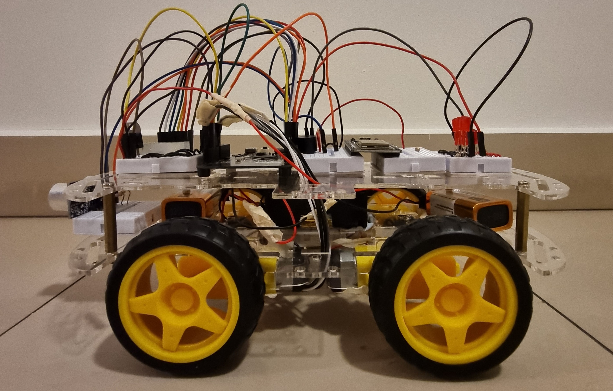

# CG2271 Real Time Operating Systems (RTOS)
The aim of the project is to design a RTOS-based robotic car that will be controlled through an Android app. The robotic car must be able to fulfil the following features:
1. Establish a WiFi connection with the Android App
2. Receive commands from the Android App and execute the correct response
3. Move the car in multiple directions. 
4. Control the various LED’s according to the car’s status
5. Play different sounds/tunes according to the cars status.

The KL25Z Freedom Development Board was used as the main RTOS platform. 
